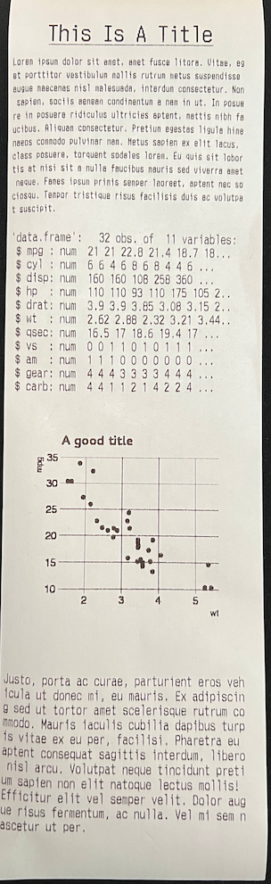

```{r pkg-knitr-opts, include=FALSE}
hrbrpkghelpr::global_opts()
```

```{r badges, results='asis', echo=FALSE, cache=FALSE}
hrbrpkghelpr::stinking_badges()
```

```{r description, results='asis', echo=FALSE, cache=FALSE}
hrbrpkghelpr::yank_title_and_description()
```

## What's Inside The Tin

The following functions are implemented:

```{r ingredients, results='asis', echo=FALSE, cache=FALSE}
hrbrpkghelpr::describe_ingredients()
```
- `escpos`: Create an `escpos` object for accumulating print commands

## NOTE

I've only tested this on a single, networked EPSON TM-T88V printer.

## Installation

```{r install-ex, eval = FALSE}
remotes::install_github("hrbrmstr/escpos", ref = "batman")
```

## Usage

```{r lib-ex}
library(escpos)

# current version
packageVersion("escpos")

```

```{r ex-01, eval = FALSE}
library(stringi)
library(hrbrthemes)
library(ggplot2)

ggplot() +
  geom_point(
    data = mtcars,
    aes(wt, mpg),
    color = "red"
  ) +
  labs(
    title = "A good title"
  ) +
  theme_ipsum_es(grid="XY") -> gg

epson_ip = "HOSTNAME_OR_IP_OF_YOUR_PRINTER"

escpos(epson_ip) |>
  pos_bold("on") %>%
  pos_align("center") %>%
  pos_size("2x") %>%
  pos_underline("2dot") %>%
  pos_plaintext("This Is A Title") %>%
  pos_lf(2) |>
  pos_underline("off") %>%
  pos_size("normal") %>%
  pos_align("left") %>%
  pos_bold("off") %>%
  pos_font("b") %>%
  pos_plaintext(
    stringi::stri_rand_lipsum(1)
  ) |>
  pos_lf(2) |>
  pos_font("a") %>%
  pos_plaintext(
    paste0(capture.output(
      str(mtcars, width = 40, strict.width = "cut")
    ), collapse = "\n")
  ) |>
  pos_lf(2L) |>
  pos_plot(gg, color = TRUE) %>%
  pos_lf(2L) |>
  pos_font("c") %>%
  pos_plaintext(
    stringi::stri_rand_lipsum(1, start_lipsum = FALSE)
  ) |>
  pos_lf(3) |>
  pos_cut() %>%
  pos_print()
```



## escpos Metrics

```{r cloc, echo=FALSE}
cloc::cloc_pkg_md()
```

## Code of Conduct

Please note that this project is released with a Contributor Code of Conduct. 
By participating in this project you agree to abide by its terms.
